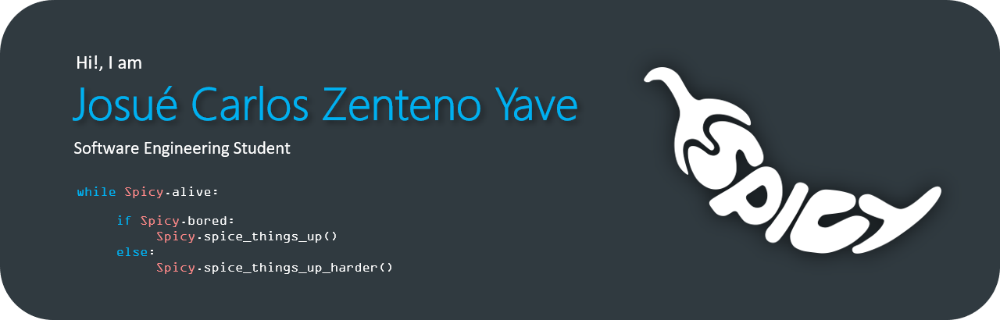

# 🌌 Welcome to my Github profile! 🌌
### Software engineering student

Coursing the fourth year of the degree at Escuela Superior de Informática - UCLM
 
 

<h1 align = "middle">🚀 Skills 🚀</h1>

## ☄️ Programming Languages

## ☄️ Frameworks

## ☄️ IDEs

## ☄️ Data Bases

